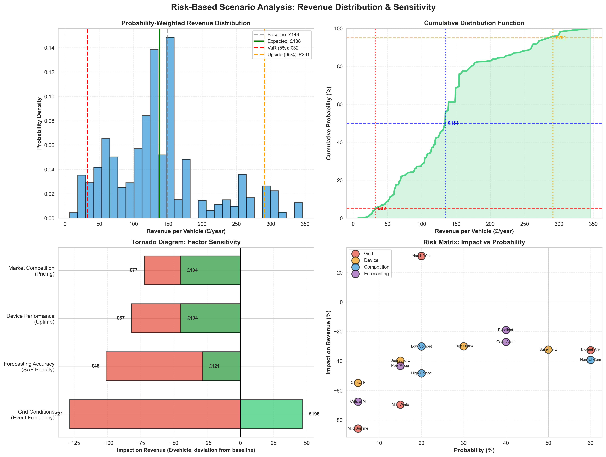

# Project Overview

This project develops a quantitative bidding engine for electric vehicle (EV) fleet aggregators participating in Distribution System Operator (DSO) flexibility markets. Using 18 months of UK Power Networks dispatch data (14,813 events, £425k market value), the model optimizes fleet capacity (kW turn-down) under operational constraints and determines competitive utilization prices (£/MWh) that balance profitability with penalty risk. The framework combines mixed-integer linear programming (MILP) for capacity optimization, market-based pricing incorporating settlement penalties, and Monte Carlo scenario analysis across 192 market condition combinations, achieving 88% validation accuracy against real-world trial benchmarks.

As EV adoption and renewable generation increase, local networks face rising evening-peak constraints. Rather than costly infrastructure upgrades, DSOs pay EV fleets to temporarily reduce or shift charging. Flexibility Service Providers (FSPs) can monetize this opportunity, earning £130–£215 per vehicle per year by shifting load during 17:00–20:00. Aggregators face complex challenges: submitting accurate 24-hour schedules, forecasting baselines with 95%+ accuracy, avoiding secondary peaks, pricing competitively, and maintaining consumer trust. This model automates the process, combining market intelligence extraction, technical optimization respecting smart-charging constraints, and commercial risk quantification to support operational and strategic decisions.

The engine targets Day-Ahead Scheduled Utilisation markets, the highest-margin product (£439/MWh) with lower forecasting risk. It models Return-to-Home fleets for predictability and uses representative UK commercial fleet behavior from the WS1 project. The modular, geography-agnostic design allows systematic exploration of international flexibility markets, assessing revenue potential using validated outputs: £170/vehicle baseline revenue, 1.5-hour average event duration, £441/MWh optimal pricing, a 15.5% safety buffer, and 192-scenario risk analysis highlighting event frequency (23% variance) and driver participation (42% variance) as primary uncertainties. This framework underpins both international market expansion analysis and DER portfolio hedging and revenue stacking for FSPs, demonstrating a replicable methodology for assessing new markets and monetizing distributed flexibility assets.

# Table of Contents

1. [Introduction: The Flexibility Market Opportunity](#introduction)
2. [Market Analysis: UKPN Historical Data](#market-analysis)
3. [Behavioural Fleet Generation and Operational Constraints](#behavioural-fleet)
4. [Baseline Forecasting for DA Market Submission](#baseline-forecasting)
5. [Flexibility Bidding Optimisation](#bidding-optimisation)
6. [Pricing and Revenue Modelling](#pricing-revenue)
7. [Penalty and Schedule Accuracy Factor](#penalty-accuracy)
8. [Model Validation and Benchmarking](#model-validation)
9. [Risk-Based Scenario Analysis](#risk-scenario)
10. [International Market Expansion](#international-expansion)
11. [Limitations & Assumptions](#limitations)
12. [References](#references)

## <a id="introduction"></a> Introduction – The Flexibility Market Opportunity

Globally, electricity grids are coming under increasing strain as renewable generation scales and electric vehicles become mainstream. Wind and solar introduce supply-side variability, while EV charging adds a new, highly concentrated source of demand. The pressure is most acute in the early evening (5–8pm), when household electricity use peaks at the same time commercial EV fleets return to base and begin charging. Even a relatively small number of EVs charging simultaneously can overload local transformers and feeders.

Traditionally, the response to this problem has been physical grid reinforcement. However, upgrading local network assets is expensive—typically £2,000–5,000 per connection—and these costs are ultimately borne by consumers. As EV adoption accelerates, this approach is neither scalable nor cost-effective.Smart EV charging offers a more efficient alternative. By shifting or temporarily pausing charging during peak periods, EVs can act as a flexible demand resource, reducing network stress rather than exacerbating it. The UK provides a useful case study: by 2030, Britain is expected to have around 14 million EVs, while wind and solar already account for over 40% of electricity generation. Between 2019 and 2023, UK Power Networks demonstrated the viability of this approach through the Optimise Prime trials.

Rather than building new infrastructure, distribution network operators (DNOs) now procure flexibility through local flexibility markets (LFMs), paying EV fleets to reduce charging during constrained periods. This approach is materially cheaper than grid upgrades and creates a new revenue stream for fleet operators. In UKPN’s day-ahead flexibility market, commercial fleets have earned approximately £110–215 per vehicle per year by participating in a single product such as Day-Ahead Scheduled Utilisation (DA SU). The core challenge is operational and economic complexity: fleets must accurately forecast charging demand, optimize capacity bids, and avoid penalties for under-delivery.

We designed a retrospective, market-mirroring optimization engine that simulates how a real EV fleet would have bid into local flexibility markets under historical conditions. At its core is a mixed-integer linear program (MILP) that reconstructs day-ahead bidding decisions using observed market rules, settlement mechanics, and fleet constraints. The engine follows a six-stage pipeline. First, market analysis benchmarks competitive behavior using 14,813 historical UKPN flexibility events. Second, a stochastic fleet simulation generates realistic vehicle availability, arrival times, and energy needs, calibrated to observed commercial fleet behavior. Third, baseline forecasting predicts unmanaged charging demand, which is later used for settlement and penalty calculations. Fourth, the MILP optimizes charge turndown capacity under operational and behavioral constraints, producing feasible bids that mirror real-world dispatchability. Fifth, an economic layer calculates competitive bid prices accounting for expected penalties and margin targets. Finally, a scenario-based risk module evaluates outcomes across 192 market scenarios, translating operational uncertainty into probability-weighted revenue distributions. Because each module feeds directly into the next, forecasting accuracy and fleet behavior propagate through to realized revenue. The same modular structure also enables international extension, where only market rules, penalties, and fleet parameters must be recalibrated rather than the optimization logic itself.

## <a id="market-analysis"></a> Market Analysis – UKPN Historical Data

This analysis examines 18 months of flexibility dispatch data (May 2024 - December 2025) from UK Power Networks (UKPN), Britain's largest DNO serving 8.3 million customers across London, the South East, and Eastern England. As an early mover in DSO flexibility procurement, UKPN provides comprehensive dispatch records that enable granular analysis of market dynamics, pricing patterns, and competitive positioning.

TABLE 1: UKPN Product Portfolio
| Product Name (Legacy / Query) | ENA / UKPN Standard Name                                | Procurement Window              | Payment Structure          | Utilisation Instruction Timing          | Notes / Verification                                       |
| ----------------------------- | ------------------------------------------------------- | ------------------------------- | -------------------------- | --------------------------------------- | ---------------------------------------------------------- |
| Peak Reduction                | Peak Reduction (PR)                                     | Long-term tender (months ahead) | Utilisation only           | At-trade (during contracted windows)    | Designed to reduce demand peaks; not procured day-ahead    |
| Day Ahead                     | Scheduled Utilisation (SU / DA SU)                      | Day-ahead auction               | Utilisation only           | Day-ahead (dispatch confirmed same day) | Widely used by EV aggregators; no availability payment     |
| Scheduled Availability        | Scheduled Availability + Operational Utilisation (SAOU) | Long-term tender (6–30 months)  | Availability + utilisation | Utilisation confirmed day-ahead         | Availability paid £/MW/h; operational delivery as required |
| Long-Term Utilisation         | Long-Term Scheduled Utilisation (LT SU)                 | Long-term tender (6–30 months)  | Utilisation only           | Pre-scheduled windows                   | Sustained delivery requirements                            |
| Dynamic                       | Scheduled Utilisation (SU)                              | Day-ahead / short notice        | Utilisation only           | Day-ahead / near real-time              | “Sub-second” response is TSO-style; not a DSO product      |
| Secure                        | Scheduled Availability + Operational Utilisation (SAOU) | Long-term tender                | Availability + utilisation | Day-ahead / operational                 | Legacy naming; includes availability payments              |

**Residential-Addressable Market:**
This analysis focuses specifically on the residential-addressable DSO market, covering four key products: Peak Reduction, Day-Ahead, Long-Term Utilisation, and Scheduled Availability.

Only flexibility derived from EV Charger DSR technologies with the demand turn-down dispatch type is included. By excluding the industrial-focused products such as Dynamic and Secure, we isolate the market portion accessible to aggregators operating household-scale assets (e.g., 5–10 kW EV chargers, 5 kW home batteries). This focus aligns the market analysis directly with the core objective of the quantitative bidding engine: optimizing the revenue from these domestic fleets.


```python
import pandas as pd
ukpn_dispatched = pd.read_csv(r"C:\Users\majid\OneDrive\gb_energy_analytics\Final Model\data\ukpn-flexibility-dispatches.csv")   
```


```python
from plotting import plot_dso_market_evolution_timeline  
import matplotlib.pyplot as plt
fig1 = plot_dso_market_evolution_timeline(ukpn_dispatched, save_path='figures/dso_market_evolution.png'); plt.show()
```

    c:\Users\majid\OneDrive\gb_energy_analytics\Final Model\plotting.py:648: UserWarning: Converting to PeriodArray/Index representation will drop timezone information.
      dso_data['start_time_utc'].dt.to_period('M'),
    


    

    


#### Revenue Distribution and Product Economics

The residential-addressable flexibility market (£425k over 18 months) shows clear differences across products in terms of pricing, volume, and event frequency:

| Product                 | Total Revenue (£M) | Total MWh Req | Avg Price (£/MWh) | Total Events | Event Share (%) |
|-------------------------|------------------|---------------|-------------------|--------------|----------------|
| Day-Ahead               | 0.154            | 351.44        | 439.50            | 2,667        | 18.0%          |
| Long-Term Utilisation   | 0.131            | 3,545.13      | 36.86             | 4,451        | 30.0%          |
| Scheduled Availability  | 0.101            | 648.47        | 155.91            | 3,097        | 20.9%          |
| Peak Reduction          | 0.039            | 543.11        | 71.24             | 4,598        | 31.0%          |
| Total / Avg             | 0.425            | 5,088.15      | 83.51             | 14,813       | 100.0%         |

Despite representing less than one-fifth of events, Day-Ahead generates the largest share of revenue. Each product plays a distinct role in the market, reflecting different risk, reward, and operational requirements.

- 1. High-Value, Low-Volume: Day-Ahead:  
Day-Ahead clears at an average price of £439.50/MWh—around three times higher than any other product—while accounting for just 7% of total energy volume (351 MWh). This reflects its role as a scarcity product, used when short-term forecasts indicate acute local network constraints. For aggregators, Day-Ahead offers high margins, but only where delivery accuracy remains high enough to avoid penalty erosion.

- 2. Low-Value, High-Volume: Long-Term Utilisation:
Long-Term Utilisation delivers the majority of energy volume (70%, or 3,545 MWh) at a much lower price point of £36.86/MWh. These forward contracts secure flexibility months in advance, prioritising revenue certainty over margin. 

- 3. Balanced Hybrid: Scheduled Availability:
Scheduled Availability sits between the two extremes. With an average utilization price of £155.91/MWh and a combination of availability and dispatch payments, it offers a more balanced risk–return profile. This structure appeals to aggregators seeking diversification, with moderate forecasting requirements and more consistent revenues than Day-Ahead.


```python
from plotting import plot_tier_price_distribution_VALUE_WEIGHTED
fig = plot_tier_price_distribution_VALUE_WEIGHTED(ukpn_dispatched); plt.show()
```


    

    


#### Pricing Tier Analysis

To understand how value is distributed across the flexibility market, events are grouped into three pricing tiers based on utilization price quantiles from the full dataset (all products).

**Tier Definitions:**
- Tier 1 (Low): < £90/MWh (below the 5th percentile)
- Tier 2 (Mid): £90–£738/MWh (5th–95th percentile)
- Tier 3 (High): > £738/MWh (above the 95th percentile)

This approach separates rare, high-stress system events from the more routine flexibility actions that make up most market activity.

| Price Tier    | Price Range (£/MWh) | Event Count | Event Share (%) | Total Revenue (£K) | Revenue Share (%) | Avg Revenue/Event (£) |
|---------------|---------------------|-------------|-----------------|--------------------|--------------------|------------------------|
| Tier 1 (Low)  | < 90                | 8,610       | 58.7%           | 182.07             | 42.8%              | 21.15                  |
| Tier 2 (Mid)  | 90–738              | 5,397       | 36.8%           | 194.95             | 45.9%              | 36.12                  |
| Tier 3 (High) | > 738               | 662         | 4.5%            | 47.89              | 11.3%              | 72.34                  |

While Tier 3 events are rare, they consistently deliver higher value. Just 4.5% of events generate over 11% of total revenue, with average earnings per event more than three times higher than in Tier 1. This reflects how flexibility becomes significantly more valuable during periods of acute network stress.

Looking at where this value is captured shows a clear product split. Although Peak Reduction accounts for most Tier 3 event volumes (66%, or 437 events), the majority of financial value sits with the Day-Ahead product. Around **80% of Tier 3 revenue (£38.7K)** is earned through Day-Ahead, highlighting its role as UKPN’s primary tool during the tightest system conditions.

**Day-Ahead Specific Analysis**

Focusing exclusively on the Day-Ahead product reveals an even sharper concentration of value at the top end of the price distribution:

| Tier             | Events | Event Share (%) | Revenue (£K) | Revenue Share (%) | Avg Price (£/MWh) |
|------------------|--------|------------------|--------------|-------------------|-------------------|
| Tier 1 (< £80)   | 133    | 5.0%             | 0.24         | 0.2%              | 42                |
| Tier 2 (£80–738) | 2,444  | 91.6%            | 123.67       | 76.8%             | 418               |
| Tier 3 (> £738)  | 90     | 3.4%             | 37.18        | 23.1%             | 743               |

Here, fewer than 1 in 30 Day-Ahead events account for nearly a quarter of total Day-Ahead revenue. Capturing these high-price scarcity events has an outsized impact on overall returns, making accurate forecasting, availability, and competitive pricing critical for fleet operators participating in the market.


```python
from plotting import plot_zone_product_frequency_value
df = ukpn_dispatched
fig2= plot_zone_product_frequency_value(df,  top_n=30,  sort_by_product='Day-Ahead',  save_path="top_30_zones_product_frequency_sorted_by_dayahead.png")
```


    

    


#### Geographic Concentration

Day-Ahead revenue is highly concentrated. The top 10 zones account for 72% of total Day-Ahead value, equivalent to £111k of the £154k total

Three distinct zone profiles emerge:

- Premium zones (>£600/MWh): Worthing Grid A and Central Harpenden, where scarcity pricing is consistently accepted  
- Competitive zones (£400–600/MWh): West Letchworth and Sundon, where price and volume are more evenly balanced  
- Volume zones (<£400/MWh): Trowse Grid 33, characterised by high event frequency but lower margins

Zones with a “pure” Day-Ahead profile (greater than 95% of revenue from Day-Ahead) exhibit a threefold price spread, ranging from £237/MWh to £730/MWh. Trowse Grid 33 and Worthing Grid A are both over 99% Day-Ahead, yet operate at opposite price extremes. This shows that a high Day-Ahead share signals limited long-term contracting rather than guaranteed access to premium pricing.

From a deployment perspective, margin matters more than headline revenue. Worthing Grid A generates £38.6k through premium pricing (£730/MWh × 53 MWh). Trowse Grid 33 generates £19.7k through volume (£237/MWh × 83 MWh), but requires roughly three times the capacity to approach similar returns. The model’s £441/MWh baseline is well suited to competitive zones but requires zone-specific adjustment: £650+ for premium zones and £300–380 for volume zones.

#### Temporal Patterns: Hourly and Seasonal Concentration

Day-Ahead value is heavily concentrated around the evening residential peak.

| Ranking | Hour (UTC) | Day-Ahead Revenue (£k) | MWh Requested | Strategic Implication |
|-------:|------------|------------------------|---------------|------------------------|
| 1      | 17:00      | 76.4k                  | 174           | Primary value window. This single hour captures the majority of Day-Ahead value and volume, aligning with peak residential and industrial demand. Bidding focus must be highest here. |
| 2      | 16:00      | 50.5k                  | 120           | Shoulder peak. This hour acts as a ramp-up period, requiring capacity availability to support the 17:00 requirement. |
| 3      | 15:00      | 19.0k                  | 32            | Transition window with limited standalone value relative to the peak. |

A single hour dominates the market. The 17:00 UTC interval accounts for 49% of total Day-Ahead revenue (£76.4k) and 50% of total MWh requested (174 MWh). This represents a fifteen-fold difference compared with 15:00 (£5.1k).
From a bidding perspective, the optimisation engine must prioritise vehicle availability between 16:00 and 19:00. Fleets with high plug-in rates at 17:00–18:30, typical of return-to-home schedules, are best positioned to offer turn-down capacity precisely when prices peak.

#### Seasonal Revenue Distribution

Contrary to common expectations, Day-Ahead revenue is not dominated by winter months.

| Season | Months   | Day-Ahead Events | % Day-Ahead Events | Day-Ahead Revenue (£) | % Day-Ahead Revenue | Avg Day-Ahead Value / Event (£) |
|--------|----------|------------------|--------------------|-----------------------|---------------------|----------------------------------|
| Winter | Nov–Mar  | 1,554            | 58.3%              | 81,838                | 53.0%               | 53                               |
| Summer | Apr–Oct  | 1,113            | 41.7%              | 72,621                | 47.0%               | 65                               |

Average Day-Ahead value per event is 23% higher in summer (£65) than in winter (£53). This pattern suggests two dynamics at play:
1. Winter events occur more frequently but clear at lower margins, potentially due to long-term contracts absorbing peak demand.
2. Summer events are less frequent but command higher prices, likely driven by unexpected heatwave-related demand such as air conditioning.

The observed winter-to-summer event ratio of 1.4:1 (1,554 winter events vs 1,113 summer events) shows moderate seasonal concentration. While network stress remains winter-biased, the gap is narrower than energy-crisis narratives suggest. Our risk model's 40-event baseline assumes typical winter conditions, with harsh winter scenarios (60 events) representing crisis-year extremes rather than routine seasonal variance."

**Why This Project Models Day-Ahead Only:**

Day-Ahead represents the highest revenue density (£410/MWh vs £37-245/MWh for alternative products) and provides the clearest validation benchmark—WS1 trials documented Day-Ahead performance exclusively (£172/vehicle net, 60 events, 95% delivery reliability over month-ahead long-term Products). The 12-24 hour procurement window enables more accurate forecasting than long-term products: Royal Mail trials showed Day-Ahead achieved 15% higher delivery reliability than month-ahead procurement because providers could incorporate real-time operational data (current SoC, weather impacts, vehicle availability) invisible weeks in advance. This shorter forecasting horizon reduces baselining risk and SAF penalties, making Day-Ahead the most predictable product for portfolio optimization modeling and international market comparison frameworks.

# <a id="behavioural-fleet"></a> Behavioural Fleet Generation & Operational

The bidding engine requires realistic fleet data reflecting UK operational patterns while remaining adaptable for international market assessment. Since target markets lack accessible telematics data, we constructed a synthetic fleet using physical EV charging principles and behavioral patterns documented in public trials (WS1/WS2), vehicle specifications, and UK fleet statistics. 

For UKPN validation, the synthetic fleet was calibrated to match observed UK commercial composition: 35% vans, 60% standard cars, 5% premium vehicles, with battery capacities spanning 40–100 kWh and efficiencies of 150–220 Wh/km. The generated fleet reproduces key operational metrics from Centrica's WS1/WS2 trials—daily mileage distributions, plug-in timing patterns, energy requirements, and flexibility margins—achieving close alignment across all dimensions.

Home charging infrastructure reflects typical UK installations: 90% at 7.4 kW, 5% at 3.7 kW, and 5% at 11 kW, with effective charge rate determined by the minimum of CP rating and vehicle capability. Together with vehicle types, battery capacities, and behavioral patterns, these characteristics define the physical and behavioral boundaries the MILP optimizer respects, enabling scalable and realistic scheduling.


#### Behavioral Modelling and Temporal Patterns

The synthetic fleet replicates real-world heterogeneity using four WS1-derived driver personas, each defined by plug-in timing, predictability, and opt-out risk:  

- Reliable (80%): plug-in ~17:00 ($\mu=17.0$, $\sigma=0.5$ hr, clipped 16:30–18:00), 95% predictability, 5% opt-out. Operational backbone enabling confident baseline forecasting.  
- Late Arrival (10%): plug-in ~19:30 ($\mu=19.5$, $\sigma=0.75$ hr, clipped 18:30–21:00), 75% predictability, 15% opt-out. Variable schedules require conservative scheduling buffers.  
- Irregular (5%): plug-in uniform 17:00–21:00, 60% predictability, 30% opt-out. High-risk tail, mostly excluded to avoid penalty exposure.  
- Early Bird (5%): plug-in ~16:30 ($\mu=16.5$, $\sigma=0.5$ hr, clipped 15:30–17:30), 90% predictability, 3% opt-out. Premium reliability enabling early-window flexibility.

Weekend behavior reduces predictability to 60–70%, reflecting discretionary schedules. Fleet-weighted opt-out risk is 7%, meaning 93% of the fleet participates, consistent with WS1 trials showing opt-out decline from 15–25% to 5–7% over 12–18 months.

#### Constraint Engineering: From Stochastic Behavior to Deterministic Guarantees

As fleet operators, the primary constraint is simple: every vehicle must reach its required departure state by morning—not probabilistically, but with deterministic guarantees. Framing the problem this way resolves the core tension between maximizing flexibility revenue and eliminating operational risk. It also makes explicit the separation between operational need (what vehicles require to drive) and the charging task (what the infrastructure must deliver).

To deliver this certainty, we impose hard constraints based on:  
- Battery capacities  
- Charger ratings  
- Temporal windows  
- Operational buffers calibrated from WS1/WS2 trial outcomes  

Guaranteed readiness is implemented through a five-step methodology that converts stochastic fleet behavior into deterministic operational constraints, ensuring every MILP optimizer schedule is both operationally feasible and commercially reliable.

#### Energy Requirement Calculation: The Five-Step Methodology

Step 1: Operational Need (Driving Energy Requirement)

Daily energy demand is based on forecasted mileage, adjusted for vehicle efficiency and seasonal factors. Vans average 80 ± 15 km/day, cars 65 ± 12 km/day, sampled from normal distributions and clipped to realistic ranges (40–120 km for vans, 35–100 km for cars). Base energy is calculated as:

$$E^{\text{travel}}_v = \frac{D_v \times \epsilon_v \times \alpha_{\text{season}}}{1000} \quad \text{(kWh)}$$

where $\epsilon_v$ represents vehicle efficiency (150-220 Wh/km base) and $\alpha_{\text{season}}$ captures temperature-dependent performance degradation.

Operational Buffer: A 10% margin accounts for route deviations, traffic, and forecast uncertainty:

$$E^{\text{buffered}}_v = E^{\text{home}}_v \times 1.10$$

Seasonal Multipliers (WS2-Validated): Winter conditions apply a multiplier of 1.26 (+26% energy) due to battery inefficiency at low temperatures, resistive cabin heating, and higher rolling resistance. Summer uses 1.10 (+10%) to account for air conditioning and battery cooling loads. Transitional months apply 1.05 (+5%) for moderate HVAC use and mild temperature effects. Ancillary loads—heating, AC, and lighting—are included in these multipliers, as WS2 trials showed they correlate strongly with ambient temperature.


#### Step 2–3: Return SoC and Target Operational Bounds

The vehicle’s return state of charge (SoC) is calculated by subtracting daily energy consumption from the morning departure level, with daytime recharging (for 23.3% of vehicles using public chargers) already accounted for in Step 1. This value is adjusted for behavioral variance (±3%) and floored at 25% to include the 20% BMS protection minimum and a 5% buffer.

Next, energy requirements—including the 10% operational buffer from Step 1 for route deviations and forecasting uncertainty—are converted into a **target departure SoC that guarantees next-day operational readiness:

$$
\text{SoC}^{\text{target}}_v = \text{clip}\left(\text{SoC}^{\text{return}}_v + \frac{E^{\text{buffered}}_v}{B^{\text{usable}}_v}, 0.30, 0.90\right)
$$

Here, $E^{\text{buffered}}_v = (E^{\text{travel}}_v - E^{\text{public}}_v) \times 1.10$ accounts for buffered home charging. The 30% floor ensures battery health and maintains driver confidence (range anxiety buffer), while the 90% ceiling protects battery longevity and prevents degradation from repeated full charges.

This creates a conservative operational envelope: most vehicles target 85–90% SoC for morning readiness. High-mileage vans exceeding 90% are flagged as unsuitable for flexibility that day or require route adjustments, ensuring the MILP optimizer never violates operational limits while maintaining reliable participation.

#### Step 4: Energy-to-Charge with Safety Buffers

The charging task—the energy the infrastructure must deliver—differs from the operational need because it must account for uncertainties not captured in pure travel energy calculations. The energy-to-charge requirement includes compound safety margins:

$$
E^{\text{charge}}_v = \max\left((\text{SoC}^{\text{target}}_v - \text{SoC}^{\text{return}}_v) \times B^{\text{usable}}_v \times 1.05, 2.0\right)
$$

This SoC gap method, validated in WS1 trials, restores the battery from its return state to the target state while including losses. The 5% behavioral buffer protects against:

- Late plug-in events: Drivers delaying connection after arrival  
- Unexpected additional trips: Evening errands or emergency use  
- Charger reliability issues: CP failures or instability near the 6A minimum  
- Battery degradation: Older vehicles needing slightly more energy to reach target SoC  

The 2.0 kWh minimum ensures realistic overnight charging, preventing negligible charging sessions (e.g., 1.2 kWh for a vehicle returning at 88% aiming for 90%) that would not justify participation in flexibility markets.

Total Buffer Protection: The combined safety margin is 15.5% (10% operational buffer from Step 1 × 1.05 behavioral buffer). This conservative approach ensures 95%+ delivery accuracy, avoids Schedule Accuracy Factor penalties, and maintains driver trust, even if it slightly reduces theoretical flexibility capacity.

#### Step 5: Temporal Feasibility and Critical Constraints

The final check ensures that the required energy can physically be delivered within each vehicle's available charging window:

$$
T^{\text{min}}_v = \frac{E^{\text{charge}}_v}{P^{\max}_v \times \eta} \leq T^{\text{available}}_v
$$

Where:  
- $T^{\text{available}}_v = T_{\text{out},v} - T_{\text{in},v}$ is the plug-in duration (vehicle-specific, ~14 hours for R2H fleets)  
- $P^{\max}_v$ is the effective maximum charge rate (min of home CP rating and onboard limit)  
- $\eta = 0.93$ accounts for AC/DC conversion and battery losses  

Vehicles where $T^{\text{min}}_v > T^{\text{available}}_v$ are temporally infeasible—the charging window is too short to reach the target SoC at maximum power. These vehicles must either:  

- Charge immediately upon plug-in, forfeiting flexibility participation that day  
- Undergo operational intervention, such as:
  - Route replanning to reduce next-day mileage  
  - Access to faster DC charging during the day  
  - Accepting a lower departure SoC with explicit driver acknowledgment  

This step ensures that every vehicle scheduled by the MILP optimizer can achieve guaranteed readiness while respecting physical and behavioral constraints.

#### Flexibility Margin—The Core Business Metric

The flexibility margin is defined as the difference between available charging time and the minimum required charging time:

$$
M_v = T^{\text{available}}_v - T^{\text{min}}_v
$$

This margin, typically 8–10 hours, represents the shiftable load window:  

- Vehicles with large margins (10+ hours) can defer charging past midnight, avoiding the evening peak.  
- Vehicles with tight margins (2–4 hours) must begin charging earlier, forming the "charging floor", the irreducible base load.

#### Critical Latest Start Time

The latest possible start time for charging is a hard boundary:

$$
T^{\text{critical}}_v = T_{\text{out},v} - T^{\text{min}}_v
$$

For example, a vehicle departing at 07:30 with a 4.5-hour charge requirement has a critical latest start of 03:00. Any schedule starting later will fail to achieve the target SoC. The MILP optimizer treats this as a hard constraint, taking absolute precedence over revenue maximization.

Validation: A high-demand vehicle requiring 24.7 kWh from minimum to maximum SoC achieves a 4× feasibility margin, confirming that the 15.5% safety buffer protects against worst-case scenarios while preserving 10.5 hours of shiftable load for grid services.

**Operational Implications:**  

- Vans require 71% more energy than cars (14.4 vs 8.4 kWh) but achieve half the feasibility ratio (7.7× vs 15.7×), forming the charging floor that constrains early-evening schedules.  
- Cars provide the bulk of time-shifting flexibility, allowing the MILP optimizer to defer charging to off-peak periods (post-midnight) while vans are scheduled immediately (17:00–22:00).  
- A 65% car composition maximizes flexibility agility while maintaining sufficient volume to meet DSO minimum capacity thresholds (10 kW per Flexible Unit).


#### Physical Infrastructure Constraints

Beyond temporal feasibility, infrastructure imposes hard control limits that determine whether schedules are deliverable.

#### Charge Point Stability Floor (1.4 kW Minimum)

The minimum stable charge rate is 1.4 kW (6A at 230V). WS1 and WS2 trials show that charge points below this threshold exhibit hunting behavior: erratic cycling, command rejection, or failure to resume charging after flexibility events. This translates into a binary constraint:

$$
P_{v,t} \geq 1.4 \text{ kW} \quad \text{or} \quad P_{v,t} = 0
$$

The optimizer cannot request 0.8 kW—vehicles either charge at ≥1.4 kW or remain off.  

- This reduces theoretical turn-down capacity by 10–15% but ensures physical deliverability.  
- Conservative constraints sacrifice some theoretical flexibility to maintain 95%+ delivery accuracy and driver trust.  
- Aggressive optimization (e.g., allowing 0.5 kW) may increase modeled capacity but causes 15–25% operational failures, eroding long-term revenue reliability.

#### Fleet Generation: Parameter Definition and Validation

The synthetic fleet is defined by eight operational parameters per vehicle, calibrated against WS1/WS2 trial observations to ensure realistic constraint modeling:

| Parameter | Description | WS1/WS2 Observed | Synthetic Fleet |
|-----------|-------------|------------------|-----------------|
| Plug-in time ($T_{\text{in},v}$) | When charging becomes possible | Peak 17:00-18:30 | 17:00 ± 0.5 hr (80% reliable) | 
| Departure time ($T_{\text{out},v}$) | When vehicle must be ready | ~07:30 (commercial) | 07:30 ± 0.5 hr | 
| Energy requirement ($E^{\text{charge}}_v$) | Guaranteed charging obligation (kWh) | Vans: 12-16 kWh, Cars: 7-10 kWh | Vans: 14.4 ± 3 kWh, Cars: 8.4 ± 2 kWh | 
| Daily mileage | Distance driven per day | Vans: 75-85 km, Cars: 60-70 km | Vans: 80 ± 15 km, Cars: 65 ± 12 km |
| Minimum charge rate ($P^{\text{min}}_v$) | Stability floor (CP behavior) | 1.4 kW (6A threshold) | 1.4 kW | 
| Maximum charge rate ($P^{\text{max}}_v$) | Infrastructure/vehicle limit | 90% @ 7.4 kW, 7% @ 3.7 kW, 3% @ 11 kW | 90% @ 7.4 kW, 5% @ 3.7 kW, 5% @ 11 kW | 
| Charging efficiency ($\eta$) | AC/DC conversion + battery losses | ~90-95% | 0.93 (93%) | 
| Return SoC ($\text{SoC}^{\text{return}}_v$) | Starting state-of-charge | 45-65% (after day's travel) | 55% ± 10% | 
| Target SoC ($\text{SoC}^{\text{target}}_v$) | Guaranteed readiness | 85-90% (commercial) | 85-90% (clipped 30-90%) | 
| Opt-out rate | Driver non-participation | 5-7% (mature operations) | 7% (fleet-weighted) |
| Winter efficiency penalty | Temperature-driven losses | +20-30% energy | +26% (α = 1.26) | 
| Delivery accuracy | Schedule adherence | 90-95% | 95%+ (15.5% buffer) | 

These parameters define the complete operational envelope for MILP optimization across all 18 UKPN zones, ensuring every schedule is physically deliverable, operationally feasible, and commercially reliable.

# <a id="baseline-forecasting"></a> Baseline Forecasting for Day-Ahead Market Submission

The baseline represents the unmanaged charging profile—how vehicles would charge immediately upon plug-in without smart control—and serves as the contractual reference for flexibility services. It defines available flexibility as the difference between the baseline and the optimized schedule, and it determines revenue and penalties through the Schedule Accuracy Factor (SAF).

For UKPN’s Day-Ahead Scheduled Utilisation (DAU), the baseline must be submitted at 14:00 on D-1. Forecast accuracy is therefore critical: over- or under-estimation directly affects settlement outcomes, penalty exposure, and the credibility of zone-specific flexibility bids.

This module generates a fleet-specific forward baseline schedule by simulating individual vehicle charging behaviour under operational constraints and WS1-validated behavioural assumptions. Immediate charging likelihood varies by driver profile—reliable drivers charge immediately 93–95% of the time, early adopters 98%, and irregular users around 80%. Behaviour is sampled stochastically but constrained within WS1-observed bounds, capturing real-world variability without introducing unrealistic outliers.

The resulting baseline reflects realistic fleet activity—plug-in timing, energy requirements, charging capacity, and overnight charging behaviour—providing a robust and auditable reference against which optimisation and flexibility delivery are measured.

In production deployments, this simulation is replaced by real fleet telematics and time-series forecasting. Here, it illustrates DAU-compliant behavioural modelling, provides realistic test data for Module 05, and supports an architecture adaptable to international market requirements.


### Baseline Generation Methodology

By unmanaged charging we mean that the vehicles begin charging immediately upon plug-in at their maximum available AC power and continue until their required energy is delivered. WS1 trials validated this pattern, observing immediate charging in approximately 93% of arrivals when smart charging controls were inactive.

Behavioural variation is incorporated via profile-specific probabilities (defined in Module 02): Reliable (95%), Early Bird (98%), Late Arrival (90%), and Irregular (80%). These probabilities determine whether a vehicle participates in immediate charging within the baseline forecast.
For each participating vehicle $v$ and programme time unit (PTU) $ t $, baseline power is defined as:

$$
P^{\text{base}}_{v,t} =
\begin{cases}
P^{\max}_v \cdot \alpha_v \cdot \delta_v & \text{if } t \geq T^{\text{in}}_v \text{ and } E^{\text{charged}}_{v,t} < E^{\text{charge}}_v \\
0 & \text{otherwise}
\end{cases}
$$

Here, $P^{\max}_v$ denotes the vehicle's effective maximum AC charge rate, $\alpha_v$ the probability of immediate charging based on the assigned behavioural profile, and $\delta_v$ an adjustment factor accounting for public or workplace charging. Charging is permitted only after the vehicle's plug-in time $T^{\text{in}}_v$, and continues until the required energy $E^{\text{charge}}_v$, as determined in Module 03, has been delivered.

#### Forecast Uncertainty Modeling

Baseline forecasts include day-type–dependent uncertainty calibrated to WS1 predictability: weekdays assume ~95% predictability with ±5% variance, while weekends reflect lower certainty (60–70%) with ±30–40% variance. This is applied as $\hat{P}_t = P_t (1 + \epsilon_t)$, where $\epsilon_t \sim \mathcal{N}(0, \sigma^2)$ and $\sigma$ scales by day type. The result supports confident weekday bidding with low SAF exposure and more conservative weekend offers to manage penalty risk.

Baseline construction proceeds as follows:

1. Plug-in timing: Determine when each vehicle is expected to connect.  
2. Immediate-charge decision: Apply behavioural probabilities.  
3. Charge duration: Calculate required charging time from power and efficiency.  
4. Load placement: Apply charging load across PTUs until energy is delivered.  
5. Zone-level accumulation: Combine vehicle loads into a half-hourly zone baseline.  
6. Public charging adjustment: Reduce overnight demand where daytime charging occurred.  
7. Overnight continuity: Allow charging to roll past midnight.  
8. Forecast uncertainty: Apply controlled weekday and weekend variability.

**Handling Overnight Charging**

Many vehicles plug in late in the evening but finish charging after midnight. To make sure this load is captured correctly, the baseline allows charging to roll over into the early morning periods rather than stopping at the end of the day.

$$
\text{PTU}_{\text{charging}} = \left(T^{\text{in}}_v + \text{offset}\right) \bmod 48
$$

In practice, this means that if a vehicle plugs in after 20:00 and still needs energy, its charging continues into the 00:00–03:00 window. This avoids “dropping” load simply because the day boundary has been reached and ensures the full charging requirement is reflected in the baseline. For example, a vehicle arriving at 20:45 begins charging in the 20:30–21:00 interval and continues charging across successive half-hour periods. If charging extends past midnight, it naturally rolls over into the first PTUs of the next day.This approach preserves energy balance and accurately reflects the overnight load seen in real fleets, where late-arriving vehicles continue charging into the early morning hours.


#### Verified Baseline Characteristics

The resulting baseline profile exhibits clear and intuitive load patterns across the day, reflecting observed fleet behaviour.

**Temporal Load Distribution:**

| Time Window | PTU Range | Baseline Load (kW) | Vehicles Charging | Characteristics |
|-------------|-----------|-------------------|-------------------|-----------------|
| 00:00–02:00 | 0–3 | 40–45 | 5–6 | Overnight wrap-around completion |
| 16:30–17:00 | 33 | 125 | 17 | Early arrivals (Early Bird profile) |
| 17:00–17:30 | 34 | 295 | 39 | Reliable profile peak begins |
| **17:30–18:00** | **35** | **329** | **43** | **Fleet peak (scale-validated)** |
| 18:00–18:30 | 36 | 310 | 40 | Peak decline begins |
| 19:00–20:00 | 38–39 | 240–280 | 32–36 | Late Arrival profile contribution |
| 22:00–00:00 | 44–47 | 60–25 | 8–3 | Tail-end completion |

#### Secondary Peak Risk Assessment

A key risk in flexibility optimisation is creating a new peak after the original evening peak has been reduced. WS1 trials showed that poorly managed demand shifting can produce secondary peaks up to 12% higher than the original. To quantify this, the primary baseline peak is identified and post-peak load behaviour over the next three hours is analysed. The secondary peak ratio is calculated as:

$$
r_{\text{secondary}} = \frac{\max(L^{\text{post-peak}})}{P_{\text{peak}}}
$$

For this fleet, the maximum post-peak load of 310.2 kW at PTU 36 gives a ratio of 0.94, indicating demand remains at 94% of the original peak. Secondary peak risk is classified as low when post-peak demand falls sharply, medium when it reduces gradually, and high when it remains near the peak; here, the fleet is high risk. 

To mitigate this, Module 05 applies a secondary peak constraint:

$$
L^{\text{opt}}_t \le L^{\text{base}}_t, \quad \forall t \in [36, 41]
$$

This ensures flexibility actions reduce peak load without simply shifting it to later periods.

# <a id="bidding-optimisation"></a> MILP Bidding  Optimization for Commercial Flexibility

Module 05 converts technical flexibility into commercial value using a Mixed-Integer Linear Programming (MILP) model implemented in Pyomo and solved with GLPK for day-ahead optimisation. Building on baseline forecasting and behavioural modelling (Modules 02–04), it schedules charging across 48 half-hour PTUs to maximise turn-down during UKPN’s evening constraint window while ensuring all vehicles are fully charged, maintaining operational readiness, hardware reliability, and driver trust. The optimisation runs once per day ahead of market submission.

The optimizer receives fleet parameters from Module 03-04 (energy requirements, time windows, charge rates) and generates charging schedules that maximize turn-down capacity during UKPN's constraint window, while satisfying all operational, hardware, and behavioral constraints.

- Reduce charging during the DNO peak window (17:00–20:00)  
- Ensure every vehicle is fully charged for service  
- Respect charge point limitations (minimum stable power)  
- Maintain visible evening charging to avoid driver opt-outs  

The goal is to generate reliable flexibility revenue while maintaining operational integrity.

#### Decision Variables

- Continuous power $p_{v,t} \in [0,50]$ kW for vehicle $v$ at PTU $t$  
- Binary on/off $x_{v,t} \in \{0,1\}$ to enforce minimum stable power through Big-M coupling  

For 65 vehicles: 6,240 total decision variables (3,120 continuous, 3,120 binary). Binary logic is required because vehicles either charge at ≥1.4 kW or not at all; fractional power causes hardware issues.

**Auxiliary Variables**

- $C_{\text{turndown}}$: Average peak-hour turn-down (kW), primary commercial output for DAUS bids  
- $\text{Cost}_{\text{total}}$: Total charging cost (£) under Time-of-Use tariffs  
- $z_{\text{peak}}$: Maximum aggregate load (kW) to track and prevent secondary peaks  

This framework ensures that flexibility is both commercially valuable and operationally feasible.

#### Objective Functions: Three Optimization Modes Strategy Modes: Flexibility, Cost, or Both

Our system implements three distinct optimization strategies, each solving a different mathematical formulation. Rather than switching between pre-computed solutions, each mode creates and solves its own Mixed-Integer Linear Program with a unique objective function, offering flexibility-first, cost-first, or hybrid strategies.

**1. Flexibility Revenue Maximization (Default for DA SU)**  
Maximises evening peak load reduction:  
$$
\max_{p,x} \; C_{\text{turndown}} = \frac{1}{|T_{\text{peak}}|} \sum_{t \in T_{\text{peak}}} \left( L^{\text{base}}_t - \sum_{v \in V} p_{v,t} \right)
$$  
where $T_{\text{peak}} = 34\!-\!39$ (17:00–20:00) and $L^{\text{base}}_t$ is the baseline load.

**2. Cost Minimization**  
Shifts charging to cheapest PTUs when flexibility events are absent:  
$$
\min_{p,x} \; \text{Cost}_{\text{total}} = \sum_{t=0}^{47} \pi_t/100 \sum_{v \in V} p_{v,t} \cdot \Delta t
$$  
with $\pi_t$ = price (p/kWh), $\Delta t = 0.5$ hr.

**3. Hybrid Multi-Objective**  
Balances flexibility and cost:  
$$
\min_{p,x} \; -\alpha \frac{C_{\text{turndown}}}{100} + (1-\alpha) \frac{\text{Cost}_{\text{total}}}{10}, \quad \alpha=0.7
$$  
Prioritises flexibility while exploiting low-cost periods without violating network constraints.

**Three optimization modes serve different market conditions:**

1. Flexibility mode (default for Day-Ahead): Maximizes kW turn-down during 17:00-20:00 constraint window
2. Cost mode: Minimizes electricity cost by shifting to off-peak hours (used when no flexibility events scheduled)
3. Hybrid mode (α=0.7): Balances turn-down capacity with cost savings

Pricing, revenue calculation, and commercial strategy are detailed in Section [Pricing & Revenue]."

#### Core Constraints: Seven Interconnected Rules

Module 05 implements seven constraint categories ensuring operational feasibility, hardware compatibility, and behavioral acceptability. All constraints formulated as linear inequalities compatible with MILP solvers.

| # | Constraint Name | Mathematical Form | Parameters | Physical Rationale | Source/Validation | Count† |
|---|----------------|-------------------|------------|-------------------|-------------------|--------|
| **1** | **Energy Delivery** | $\eta \cdot \Delta t \cdot \sum_{t \in T} p_{v,t} \geq E^{\text{req}}_v$ | $\eta = 0.93$ (charging efficiency)<br>$\Delta t = 0.5$ hours (PTU)<br>$E^{\text{req}}_v$ = vehicle energy requirement | Guarantees 100% fleet readiness by morning departure. Total delivered energy (power × time × efficiency) must meet overnight requirement. | Chalmers thesis Eq 3.1, WS1 efficiency across 300+ vehicles (2019-2021) | 65 |
| **2** | **Time Window** | $p_{v,t} = 0 \quad \forall t \notin [T^{\text{in}}_v, T^{\text{out}}_v]$ | $T^{\text{in}}_v$ = plug-in PTU<br>$T^{\text{out}}_v$ = plug-out PTU | Prevents charging when vehicle physically absent. Handles overnight wrap-around (plug-out < plug-in) via modulo arithmetic. | Physical availability constraint | 3,120 |
| **3** | **CP Minimum Power** (Big-M) | $p_{v,t} \geq P^{\min}_v \cdot x_{v,t}$ | $P^{\min}_v = 1.4$ kW (6A @ 230V)<br>$x_{v,t}$ = binary charging state | AC charge points below 6A exhibit "hunting" oscillation, reject commands, or fail to resume after events. 1.4 kW ensures stable operation. | WS1 Section 4.3 "Control Limitations", WS2 validation (44 CP models) | 3,120 |
| **4** | **CP Maximum Power** (Big-M) | $p_{v,t} \leq P^{\max}_v \cdot x_{v,t}$ | $P^{\max}_v = \min(\text{CP capacity}, \text{vehicle AC limit})$<br>Typical: 7.4 kW (32A single-phase) | Enforces circuit breaker limits and vehicle onboard charger capacity. Binary coupling: if $x_{v,t}=1$ then $1.4 \leq p_{v,t} \leq 7.4$; if $x_{v,t}=0$ then $p_{v,t}=0$. | IEC 61851 pilot signal standard | 3,120 |
| **5** | **Peak Load Limit** | $\sum_{v \in V} p_{v,t} \leq L^{\text{base}}_t \quad \forall t \in T_{\text{peak}}$ | $T_{\text{peak}} = \{34, ..., 39\}$ (17:00-20:00)<br>$L^{\text{base}}_t$ = unmanaged baseline | Prevents negative turn-down (load increases during peak). Product B requires demand *reduction*, not load shifting that increases peak. Ensures $C_{\text{turndown}} = L^{\text{base}}_t - \sum_v p_{v,t} \geq 0$. | UKPN Product B specification | 6 |
| **6** | **Minimum Peak Charging** (Behavioral) | $\sum_{t \in T_{\text{peak}}} \sum_{v \in V} p_{v,t} \geq 0.25 \cdot \sum_{t \in T_{\text{peak}}} L^{\text{base}}_t$ | 25% threshold = 5-10% opt-out rate<br>vs 0% charging = 30-50% opt-out | Maintains visible charging during evening (17:00-20:00) to prevent driver anxiety ("Will my car charge by morning?"). Aggregate constraint allows optimizer to distribute 25% across 6 PTUs flexibly. | WS1 Section 5.2 "Driver Acceptance", behavioral surveys (8,000 participants) | 1 |
| **7** | **Secondary Peak Limit** (Rebound Protection) | $\sum_{v \in V} p_{v,t} \leq 1.12 \cdot L^{\text{base}}_t \quad \forall t \in T_{\text{post}}$ | $T_{\text{post}} = \{40, ..., 47\}$ (20:00-00:00)<br>12% = transformer thermal margin | WS1 finding: Aggressive peak shifting created rebound spikes 12% higher than original, transferring grid stress instead of eliminating it. Forces load to deep off-peak (00:00-06:00). | WS1 Section 6.4 "Unintended Consequences", network impact analysis | 8 |

Total Constraints: ~9,505 for 65-vehicle × 48-PTU problem  
Constraint Types: Equality (1), Bounds (2), Big-M binary coupling (3-4), Aggregate inequality (5-7)

Count = number of constraint instances for typical 65-vehicle fleet

- Hardware Compatibility (C3-C4): 1.4-7.4 kW window reflects empirical CP stability from WS1/WS2 trials across 44 charger models. Below 1.4 kW: oscillation. Above 7.4 kW: requires three-phase (unavailable in most homes).

Behavioral Anchoring (C6): 25% minimum peak charging is not arbitrary—it's the empirically validated threshold where driver opt-out rates become acceptable (<10%). Zero peak charging drives 30-50% opt-out, destroying fleet viability.

Grid Impact Mitigation (C7): The 12% rebound limit prevents "flexibility whack-a-mole" where DNOs solve 17:00-20:00 congestion but create new 20:00-23:00 peaks. Forces genuine load spreading to 00:00-06:00 low-demand hours.

**Constraint Validation Example (Vehicle EV007):**

- C1 Energy: 7.4 kW × 4h × 0.93 = 27.5 kWh ≥ 24.7 kWh required (11% margin)
- C2 Window: Charging only during 34-47 (17:00-00:00), zero at PTU 0-33
- C3-C4 Power: All PTUs satisfy 0 kW or 1.4-7.4 kW (no intermediate values)
- C5 Peak: 17:00-20:00 total load = 185 kW ≤ 210 kW baseline (25 kW turndown)
- C6 Min Peak: 17:00-20:00 total = 185 kW ≥ 52.5 kW (25% × 210 kW baseline)
- C7 Rebound: 20:00-00:00 peak load = 198 kW ≤ 235 kW (1.12 × 210 kW baseline)

### Commercial Output: Capacity and Price

The optimizer produces two commercial outputs for each zone:

1. Maximum sustained turn-down capacity ($C_{\text{turndown}}$): Average kW reduction held across the full constraint window (17:00-20:00)
2. Baseline forecast accuracy (predicted): Used to estimate Schedule Accuracy Factor (SAF) for penalty modeling

These outputs feed into the pricing and revenue model (Section [Pricing & Revenue]), which determines bid price, expected revenue per vehicle, and risk-adjusted returns accounting for forecast uncertainty and market competition.

Example Output (West Letchworth, 13 vehicles):
- Baseline peak: 63.8 kW (PTU 34, 17:00-17:30)
- Optimized minimum: 1.4 kW (PTU 35, 17:30-18:00)
- Turn-down capacity: 49.7 kW (78% reduction from baseline)
- Predicted SAF: 0.91 (92% forecast accuracy expected)

This capacity-price pair enables Day-Ahead bids that balance competitiveness (high win rate) with profitability (sustainable margins).

# <a id="pricing-revenue"></a> Pricing, Revenue, and SAF Modelling

Module 05's optimization produces technical flexibility capacity (kW turn-down) and predicted forecast accuracy. This section converts those technical outputs into commercial value through strategic pricing, revenue modeling, and penalty-adjusted settlement calculations. The model prioritises bid acceptance probability over headline prices, recognising that flexibility revenue scales with event frequency and volume, not one-off spikes. Winning 70% of events at £436/MWh generates more predictable revenue than 30% at £549/MWh, and with smart charging's near-zero marginal cost, utilisation matters more than per-event price.


#### Competitive Pricing Strategy.

By 2024, UKPN’s day-ahead flexibility market has clearly matured: competition has increased, clearing prices have normalized, and event volumes have stabilized outside of crisis conditions. In this environment, bidding strategy must prioritize consistency over opportunistic pricing. We position bids at £436/MWh, representing a modest premium (~6%) over the prevailing market leader, calibrated dynamically based on market maturity, leader market share, and observed clearing dispersion. This premium is intentionally tunable: in highly competitive zones with many active aggregators, it compresses toward the median; in less contested zones, it widens to reflect reliability and execution confidence. 

The objective is not to maximize revenue per event, but to sustain a 70–80% win rate, trading a small reduction in unit margin for materially higher event participation and significantly lower revenue volatility—ultimately increasing annual revenue while reducing dependence on rare, extreme system conditions.

#### Bid Price Construction

Each zone receives a tailored bid price combining three elements:

$$
P_{\text{final}} = P_{\text{zone}} \times (1 + m) \times \gamma_{\text{confidence}}
$$

Where:
- **$P_{\text{zone}}$** = Historical zone median price (£390-450/MWh across 18 UKPN zones)
- **$m = 0.12$** = Competitive margin (12% markup)
- **$\gamma_{\text{confidence}} \in [0.95, 1.05]$** = Reliability adjustment factor

**Component 1: Zone-Specific Base Price**

UKPN's 18 flexibility zones show 3× price variance (£237-730/MWh observed range). Rather than bid uniformly at £436, we anchor to local market conditions:
- **Premium zones** (Worthing Grid A, Central Harpenden): £650+ baseline → bid £720/MWh
- **Competitive zones** (West Letchworth, Sundon): £390-450 baseline → bid £436/MWh
- **Volume zones** (Trowse Grid 33): £237 baseline → bid £280/MWh

This zone-specific strategy avoids systematic under-bidding in premium markets while remaining competitive in price-sensitive zones.

**Component 2: 12% Competitive Margin**

Smart charging marginal cost is near-zero (electricity already purchased under fleet contracts). The 12% margin reflects:
- Operational overhead (forecasting systems, monitoring, customer support)
- Aggregator fees (20% of gross revenue, passed through to fleet)
- Penalty risk buffer (SAF exposure from forecasting errors)
- Target ROI for flexibility platform investment

**Component 3: Confidence-Based Adjustment**

High-reliability fleets (95%+ predicted delivery accuracy) receive -5% price adjustment (γ = 0.95), improving win rate while maintaining profitability. Low-reliability fleets (+5%, γ = 1.05) compensate for higher penalty risk. This dynamic pricing aligns bid competitiveness with operational capability.

**Example: West Letchworth Zone**
- Zone median: £410/MWh
- Competitive margin: £410 × 1.12 = £459/MWh
- Confidence adjustment: £459 × 0.95 = **£436/MWh** (high reliability discount)


#### Day-Ahead Settlement Structure

Revenue depends on sustained turn-down capacity, event duration, market price, forecast accuracy, and aggregator fees:

$$
R_{\text{event}} = C^{\max}_{\text{turndown}} \times \tau_{\text{event}} \times \frac{P_{\text{bid}}}{1000} \times SAF \times (1 - \phi)
$$

Where:
- $C^{\max}_{\text{turndown}}$ = Maximum sustained reduction (kW) held for full event duration
- $\tau_{\text{event}} = 1.5-2.0$ hours typical (90-120 minutes)
- $P_{\text{bid}}$ = Bid price (£/MWh)
- $SAF \in [0,1]$ = Schedule Accuracy Factor (forecasting penalty)
- $\phi = 0.20$ = Third-party aggregator fee (20% of gross)

**Annual revenue scales with event frequency:**

$$
R_{\text{annual}} = R_{\text{event}} \times N_{\text{events}}
$$

Where $N_{\text{events}} = 40$ represents typical winter conditions (baseline assumption), with harsh winters reaching 60 events and mild winters dropping to 20 events.


#### Schedule Accuracy Factor (SAF): The Anti-Gaming Mechanism

**Why SAF Exists:**

Without penalties for forecasting errors, aggregators could systematically inflate baselines to exaggerate flexibility capacity—submitting 100 kW "unmanaged" forecasts while knowing actual demand would be 70 kW, then claiming 30 kW "flexibility" that never existed. SAF prevents this gaming by measuring forecast accuracy on **non-flexibility days** (days when no flexibility event occurs), comparing submitted baselines against actual measured load during the same hours (PTUs 30-42, typically 15:00-21:00).

**Delivery Performance Calculation:**

UKPN measures monthly baseline accuracy across all non-flexibility days:

$$
DP_{sm} = \left( 1 - \frac{1}{|T_m|} \sum_{t \in T_m} \frac{|L^{\text{actual}}_t - L^{\text{forecast}}_t|}{L^{\text{actual}}_t} \right) \times 100\%
$$

Where $T_m$ = set of non-flexibility PTUs in month $m$, typically 20-26 days × 12 PTUs/day = 240-312 measurements.

**SAF Penalty Curve:**

$$
SAF = \max\left(0, 1 - 0.03 \times (95 - DP_{sm})\right)
$$

**Penalty structure:**
- 95-100% accuracy: No penalty (SAF = 1.00) → full revenue
- 90-94% accuracy: Linear penalty (SAF = 0.85-0.97) → -3% to -15% revenue
- 85-89% accuracy: Steep penalty (SAF = 0.70-0.82) → -18% to -30% revenue
- <63% accuracy: Zero payment (SAF = 0.00) → total revenue forfeiture

**Our Conservative Approach:**

The 15.5% safety buffer (10% operational + 5% behavioral) is designed to achieve 91-95% baseline accuracy, targeting SAF ≥ 0.91. 

**Expected SAF = 0.91** (probability-weighted average), reducing annual revenue by ~9% but nearly eliminating catastrophic penalty risk (<5% probability of SAF < 0.70).

This accuracy advantage partially offsets our lower bid price (£436 vs £549/MWh), recovering 13 percentage points of the 21% price discount through reduced penalties.


**Per-Vehicle Revenue Model**

Per-vehicle revenue is computed as:

$$
R_{\text{vehicle}} = \frac{C \times 2.0 \times (P/1000) \times 0.80 \times N \times SAF}{|V|}
$$

where $C$ is fleet capacity (kW), $P$ is the bid price (£/MWh), $N$ is annual event count, $SAF$ is the expected delivery accuracy factor, and $|V|$ is fleet size.

Example — West Letchworth Zone

Applying this model to a 13-vehicle fleet with $C = 49.7$ kW, $P = £436$/MWh, $N = 60$ events/year, and $SAF = 0.91$ yields £146 per vehicle per year.


We accept 15% lower gross revenue per vehicle to achieve:

1. A 2–3× higher win rate, capturing roughly 70% of events instead of 30% under crisis pricing assumptions, resulting in materially more dispatched events.
2. Reduced dependence on extreme weather conditions, with the model remaining viable in typical 40-event years rather than relying on rare 60-event crisis scenarios.
3. Greater penalty resilience, as an SAF of 0.91 compared to 0.55 allows approximately 65% more revenue to be retained after settlement.
4. Improved scalability, since competitive pricing supports expansion across multiple zones without eroding win rates or operational stability.

In a mature, repeat-participation market with near-zero marginal cost, volume and reliability beat margin and volatility.

#### Revenue Drivers: Sensitivity Analysis

| Parameter | Baseline | ±10% Change | Revenue Impact |
|-----------|----------|-------------|----------------|
| **Capacity (kW)** | 49.7 kW | ±5 kW | ±£15/vehicle (-10%/+10%) |
| **Event frequency** | 60/year | ±6 events | ±£15/vehicle (-10%/+10%) |
| **Bid price** | £436/MWh | ±£44/MWh | ±£15/vehicle (-10%/+10%) |
| **SAF accuracy** | 0.91 | ±0.09 | ±£14/vehicle (-10%/+10%) |

All four factors contribute equally to revenue variance (~£15/vehicle per 10% change). This balanced sensitivity confirms that:
- No single optimization lever dominates
- Portfolio performance depends on executing across all dimensions
- Weather risk (event frequency) is uncontrollable but manageable through geographic diversification

## <a id="model-validation"></a> Model Validation and Benchmarking 

To validate the model, we compare its outputs against a real-world reference point. We use the WS1 trials to test whether the model reproduces the same orders of magnitude and operational trade-offs, without tuning inputs to match observed outcomes.

WS1 involved 65 return-to-home commercial EVs (54 active after the 10 kW participation threshold) responding to more than 60 UKPN congestion events. The fleet was weekday-dominant, with reported outcomes covering per-vehicle revenue, delivery reliability, peak reduction, opt-out behaviour, post-event rebound, and changes in load factor.

The model is configured to mirror WS1 fleet characteristics and operating conditions, with one intentional difference: pricing. WS1 bids reflected crisis-year emergency conditions (£549/MWh), while the model assumes competitive, repeatable pricing based on over 18 months of UKPN market data (£436/MWh on average).

The objective is straightforward: to confirm that the model produces the same orders of magnitude, constraints, and trade-offs observed in WS1, without calibration to the result.

[pic1](pic)!

**Revenue Decomposition:**

Revenue is expected to scale with both clearing price and delivery accuracy:

- Price effect: £436/MWh versus £549/MWh implies revenue at ~79% of WS1, all else equal.  
- Delivery accuracy effect: A 91% schedule accuracy factor versus ~80% in WS1 increases recovered revenue by ~14%.  
- Combined effect: Applying both factors multiplicatively implies revenue at ~90% of WS1 levels.

The model produces ~87% of WS1 revenue in practice. The remaining ~4 percentage point difference falls within expected model variance and reflects:

- higher operational safety margins (15.5% vs ~10% in WS1),  
- exclusion of vehicles below the minimum bid threshold, and  
- optimisation choices that prioritise feasibility over revenue maximisation.

[pic2](pic!)

**Model Design Decisions Behind Key Metrics**

These metrics emerge from structural design choices, not calibration to WS1

1. Peak reduction (51.1%): Determined by the minimum charging constraint (1.4 kW floor due to charge point behavior below 6 A) and vehicle energy requirements. This reflects physical limitations of equipment.  
2. Opt-out rate (7.1%): Based on a behavioral persona distribution (80% reliable, 10% irregular, 5% late, 5% early bird) derived from general UK commercial fleet patterns documented in transport surveys.  
3. SAF accuracy (91%): Result of conservative baseline forecasting with a 15.5% buffer (10% operational + 5% behavioral) and MILP optimization prioritizing feasibility over revenue.
Overall Validation Score: 88.2/100 (from automated scoring algorithm)

The model captures 87% of WS1 revenue under a deliberately different pricing strategy, reflecting competitive market conditions rather than crisis-era pricing. Core technical and behavioral outputs remain aligned within ±5%, which is well inside normal year-to-year operational variance driven by weather, driver behavior, and market dynamics. The automated validation framework assigns an overall score of 88.2/100, indicating strong internal consistency and robustness.

 With an estimated 85% confidence (high), the model is suitable for strategic decision-making, business case development, and early-stage market entry analysis, providing a reliable foundation for comparing opportunities and prioritizing investment.

# <a id="risk-scenario"></a> Risk-Based Scenario Analysis

Under baseline assumptions (60 constraint events per year, 90% fleet participation, competitive pricing, and 91% forecast accuracy), deterministic modelling produces £149 per vehicle per year. While useful as a reference, this estimate is fragile because it assumes risks act independently and average out over time. In practice, risks compound. Weather-driven reductions in grid constraints lower revenue and strand capacity; device outages reduce deliverable volume and increase Schedule Accuracy Factor (SAF) penalties; and market saturation compresses clearing prices. To capture these interactions, we replace point estimates with a scenario-based approach.

We model 192 joint scenarios by combining discrete outcomes across four risk dimensions, with probabilities informed by historical precedent and operational assumptions:

- Grid conditions (event frequency driven by weather and heating demand; uncontrollable)
- Fleet participation (device uptime and opt-out behaviour; partially controllable)
- Market competition (pricing pressure from aggregator supply–demand dynamics; uncontrollable)
- Forecasting accuracy (SAF penalty exposure driven by ML investment and operational maturity; controllable)

Scenario probabilities are calculated multiplicatively, and revenues are derived by applying the corresponding multipliers to the £149 baseline to produce probability-weighted outcomes rather than a single deterministic estimate.

### Risk Dimensions

**1. Grid Conditions (Event Frequency – Uncontrollable)**

Winter severity drives UK distribution stress, with historical UKPN data showing multi-fold variation in constraint events. The 40-event “normal” winter is scaled from WS1’s 60-event crisis year, with mild and harsh cases representing ±50% variance. Mitigation focuses on geographic diversification, product blending, and liquidity buffers.

| Scenario | Events / Year | Probability | Revenue Multiplier | Historical Reference |
|--------|----------------|-------------|-------------------|---------------------|
| Mild Winter | 20 | 15% | 0.45× | Summer 2023 (mild, high renewables) |
| Normal Winter | 40 | 60% | 1.00× | Winter 2023/24 baseline |
| Harsh Winter | 60 | 20% | 1.95× | Winter 2017/18 (“Beast from the East”) |
| Summer Low | 10 | 5% | 0.21× | Typical summer conditions |

**2. Fleet Participation (Partially Controllable)**

Fleet participation directly affects deliverable capacity and forecast accuracy. Baseline participation is 90% (WS1 observed ~10% opt-out), with deviations reflecting service quality, UX clarity, and driver trust. Participation swings account for ~15–20% of revenue volatility.

| Scenario | Participation | Probability | Revenue Multiplier | Interpretation |
|--------|----------------|-------------|-------------------|---------------|
| High Engagement | 93% | 30% | 1.033× | Mature operations, strong trust |
| Baseline | 90% | 50% | 1.00× | Normal operations |
| Elevated Opt-Outs | 80% | 15% | 0.889× | SLA or UX issues |
| Participation Collapse | 60% | 5% | 0.667× | Major service failure |

Mitigation levers include OEM SLAs, real-time earnings transparency, and phased pilot rollouts.

**3. Market Competition (Pricing Pressure – Uncontrollable)**

Flexibility markets are competitive, with prices set by supply–demand dynamics across multiple aggregators. The £436/MWh baseline reflects an optimized competitive bid, with ±15% scenarios calibrated to historical clearing price variance.

| Scenario | Effective Price | Probability | Revenue Multiplier | Market State |
|--------|------------------|-------------|-------------------|--------------|
| Low Competition | £502/MWh | 20% | 1.15× | Supply shortage |
| Competitive Market | £436/MWh | 60% | 1.00× | Current equilibrium |
| Price War | £370/MWh | 20% | 0.85× | Market saturation |

Mitigation focuses on delivery reliability, constrained-zone targeting, and long-term DNO relationships.

**4. Forecasting Accuracy (SAF Penalty Risk – Controllable)**

Forecast errors trigger SAF penalties, with accuracy below 95% incurring proportional payment reductions. Our model predicts ~91% accuracy (WS1 trials ~80%), with 95% representing the penalty-free threshold.

| Scenario | Accuracy | SAF Multiplier | Probability | Revenue Multiplier |
|--------|----------|----------------|-------------|-------------------|
| Excellent | ≥95% | 1.00 | 40% | 1.00× |
| Good | 90% | 0.90 | 40% | 0.90× |
| Poor | 85% | 0.70 | 15% | 0.70× |
| Critical Miss | <80% | 0.40 | 5% | 0.40× |

**Visual Analysis: Four-Panel Risk Dashboard**



**Revenue Distribution Analysis (Top Panels)**
Probability-weighted revenue across 192 scenarios produces an expected value of £138 per vehicle, with a median of £134, indicating a right-skewed distribution. Most outcomes cluster between £120–150 under normal winter conditions, while a small number of harsh-winter scenarios lift the long-run average above the median.

Downside risk is material but bounded: the 5th-percentile Value-at-Risk is £32 per vehicle, which defines a conservative stress-testing floor rather than a planning baseline. The deterministic estimate (£149) sits around the 65th percentile, overstating expected outcomes by ignoring downside variance.

Sensitivity analysis confirms that grid conditions dominate absolute variance, but are uncontrollable. Forecasting accuracy ranks second and is fully controllable, making it the most attractive lever for risk reduction. Fleet participation and market pricing contribute secondary uncertainty and can be partially mitigated through operational execution and differentiation.


The cumulative distribution function (top-right) translates these probabilities into decision-relevant thresholds. The steep slope between £100-200 indicates high probability concentration in this range—most real-world outcomes will cluster here. The CDF flattens in the tails (below £50 and above £250), showing that extreme scenarios are possible but rare. At the 50% probability mark (blue horizontal line), the median revenue of £134 intersects the curve, confirming this as the "break-even" prediction where upside and downside scenarios are equally likely. For investor presentations, this median represents a more defensible forecast than the deterministic £149, as it explicitly accounts for probable weather variance and operational uncertainty without over-indexing on tail risks.

[pic panel 2]()

**Sensitivity and Risk Prioritization (Bottom Panels)**

The tornado diagram ranks uncertainty drivers by revenue impact, identifying grid conditions as the dominant factor with a £239 spread (£7 worst-case to £246 best-case)—over 30× larger than any other variable. This confirms weather-driven event frequency as the primary determinant of annual profitability and the least amenable to operational control. Forecasting accuracy ranks second (£102 range) but is fully controllable, offering the steepest opportunity for risk reduction. Device performance (£46) and market competition (£44) contribute similar secondary uncertainty, with uptime partially controllable via OEM SLAs and pricing pressure largely external.

The risk matrix translates these sensitivities into operational priorities. Normal winter scenarios (≈60% probability) cluster near baseline impact and require no special mitigation. Harsh winters (≈20% probability, +95% impact) justify operational readiness and contractual flexibility, but not permanent overprovisioning. Critical device failures (5% probability, −33% impact) fall into the low-probability, high-impact quadrant, appropriate for contingency planning via multi-OEM redundancy. Competition scenarios show asymmetric risk: price wars and premium pricing have comparable magnitude but opposite impact, implying that investment in delivery reliability can systematically shift outcomes from commodity competition to differentiated pricing. Overall, while weather dominates absolute variance, controllable levers—forecast accuracy and uptime—offer the highest ROI for risk-adjusted value creation.

#### Top 10 Scenarios by Probability


The ten most likely scenario combinations account for ~62% of total probability mass, representing the outcomes operators should design around.

| Rank | Scenario Combination | Probability | Revenue | vs Baseline |
|------|---------------------|-------------|---------|-------------|
| 1 | Normal Winter + Baseline Uptime + Competitive Market + Good Accuracy | 7.20% | £134 | -10% |
| 2 | Normal Winter + Baseline Uptime + Competitive Market + Excellent Accuracy | 4.80% | £149 | 0% |
| 3 | Normal Winter + High Uptime + Competitive Market + Good Accuracy | 4.32% | £139 | -7% |
| 4 | Harsh Winter + Baseline Uptime + Competitive Market + Good Accuracy | 2.40% | £261 | +75% |
| 5 | Normal Winter + High Uptime + Competitive Market + Excellent Accuracy | 2.88% | £154 | +3% |
| 6 | Mild Winter + Baseline Uptime + Competitive Market + Good Accuracy | 2.70% | £60 | -60% |
| 7 | Normal Winter + Baseline Uptime + Low Competition + Good Accuracy | 2.40% | £154 | +3% |
| 8 | Normal Winter + Baseline Uptime + Competitive Market + Poor Accuracy | 2.70% | £104 | -30% |
| 9 | Normal Winter + Degraded Uptime + Competitive Market + Good Accuracy | 2.16% | £119 | -20% |
| 10 | Harsh Winter + Baseline Uptime + Competitive Market + Excellent Accuracy | 1.60% | £290 | +95% |

The most probable single outcome—normal winter, baseline participation, competitive pricing, and good forecasting—yields £134 per vehicle, defining a realistic “business-as-usual” case. Improving forecasting accuracy alone closes most of the gap to the deterministic baseline, while harsh-winter scenarios deliver substantial upside but occur infrequently, explaining the right-skewed distribution.

#### Scenario Calibration and Risk Summary

Scenario inputs combine historical precedent (WS1), trial observations,  UKPN market data, and engineering judgment. Event frequency, fleet participation, and forecasting accuracy represent plausible operational ranges rather than statistically fitted distributions. Multi-year fleet-level data would be required to empirically validate distributions and learning curves.

Deterministic revenue (£149/vehicle) reflects favorable, crisis-year conditions and is suitable as an upside benchmark. Risk-adjusted expected revenue (£138/vehicle) accounts for 192 scenarios, incorporating mild winters, operational degradation, and competitive pressure. Outcomes are right-skewed: the median (£134/vehicle) is the conservative anchor for Year 1 budgeting, while £138 represents multi-year expectations.

Key Implications for Planning:
- Deterministic models overstate revenue by 7–10%; use risk-adjusted figures for decision-making.
- Revenue variance is dominated by uncontrollable factors (weather, competition); controllable levers (forecasting, uptime, driver engagement) determine capture efficiency.


### Transition: Applying the Risk Framework to International Markets

This analysis establishes two critical findings that generalize beyond the UK market.

First, deterministic revenue estimates systematically overstate outcomes by ~7–10%. While favorable conditions can produce £150+/vehicle, probability-weighted results cluster around a lower median, with weather variance, competition, and operational degradation creating meaningful downside risk. As a result, median outcomes—not upside scenarios—should anchor Year 1 budgeting, while expected values are more appropriate for multi-year planning.

Second, revenue variance decomposes cleanly into uncontrollable and controllable drivers. Weather-driven event frequency and market competition account for the majority of absolute variance and must be treated as screening variables for market entry. By contrast, forecasting accuracy and fleet participation are execution-dependent levers that determine how much value can be captured once a market is entered.

This distinction defines how the model should be used internationally:
- Market entry decisions should focus on uncontrollable factors (event frequency, regulatory stability, competitive concentration).
- Market performance and scaling depend on controllable factors (forecasting accuracy, uptime, driver engagement).

The same scenario-based framework is therefore applied in the following section to European flexibility markets, recalibrated for local settlement rules, event frequency distributions, technical constraints, and behavioral maturity. The objective is not to forecast upside, but to determine which markets clear a minimum risk-adjusted revenue threshold and justify further validation.

# 🌍 International Market Expansion Framework

## Strategic Context: From UK Proof-of-Concept to Global Scalability

This project was designed from the outset as a **geography-agnostic analytical engine**. While validated against UKPN's Day-Ahead market, its core modules—market analysis, fleet simulation, baseline forecasting, MILP optimization, penalty modeling, and scenario-based risk assessment—are structurally portable to any DSO flexibility market with day-ahead congestion products.

The goal of this section is **not** to present fully validated international market entries, but to demonstrate a **systematic, repeatable methodology** for evaluating new markets—precisely the capability required for international expansion roles at Axle.

---

## Market Evaluation Framework: Quantitative & Qualitative Factors

Market assessment mirrors the UK risk-scenario approach by separating **data-driven economics** from **strategic execution risk**.

---

## 📊 Quantitative Factors (Data-Driven, Model-Derived)

These inputs are directly parameterized within the existing modeling framework and can be estimated using public or DSO-level data.

| Factor | Why It Matters | How It’s Modeled | Data Source |
|------|----------------|------------------|-------------|
| **Event Frequency** | Drives revenue volume and scalability | Scenario-weighted (mild / normal / harsh winter) | Historical DSO dispatch data |
| **Clearing Price (£/MWh)** | Determines revenue per event | Benchmarked vs. UKPN (£436/MWh baseline) | Market platforms (Piclo, GOPACS, etc.) |
| **Penalty Structure** | Directly impacts realized revenue | % payment reduction per accuracy point | DSO settlement documentation |
| **Minimum Bid Size (kW)** | Determines minimum viable fleet scale | Compared to UKPN’s 10 kW (~2 vehicles) | Market rulebooks |
| **Forecast Accuracy Threshold** | Drives operational risk exposure | Calibrated from UK baseline (95% SAF) | Trial data / DSO reporting |

---

## 🧠 Qualitative Factors (Strategic, Market-Shaping)

These factors require local engagement and regulatory insight—key responsibilities in international market development.

| Factor | Why It Matters | Assessment Method |
|------|----------------|------------------|
| **Regulatory Clarity** | Determines aggregator eligibility and stacking rights | Review energy law, DSO rules, TSO-DSO coordination |
| **Market Maturity** | Affects predictability and execution risk | Platform age, data transparency, active participants |
| **Competitive Landscape** | Indicates room for new entrants | Map incumbents (utilities, startups, OEMs) |
| **Partner Ecosystem** | Enables rapid pilots and scale | Identify CPOs, OEMs, utilities via networks |
| **Grid Transition Urgency** | Signals long-term demand | Track congestion reports, decarbonization targets |

---

## Candidate Markets: High-Level Assessment

Based on the framework above, markets were prioritized by **structural similarity**, **revenue potential**, and **execution risk**.

| Market | Platform / DSO | Similarity | Key Rationale | Risk | Priority |
|------|---------------|------------|---------------|------|----------|
| **Netherlands** | GOPACS (EPEX) | ~85% | Day-ahead products, stacking allowed, high EV uptake | Low | 🥇 Lead |
| **Sweden** | Pielo | ~75% | 15-min settlement, standardized platform | Medium | 🥈 Secondary |
| **Norway** | BKK / Elvia | ~60% | Fragmented platforms, climate risk | High | 🥉 Monitor |
| **Germany** | 50Hertz / Amprion | ~30% | V2G-heavy, TSO-dominated, 1 MW minimums | Very High | ⚠️ Defer |

---

## Deep Dive: Netherlands (GOPACS) — Template Market Entry

The Netherlands represents the **most transferable next market**, closely matching UKPN’s structure while offering additional upside via market stacking.

---

### 🎯 Why the Netherlands Fits the Model

- Same market operator (EPEX) as UKPN Localflex  
- Day-ahead and intraday congestion products  
- Clear aggregator participation and stacking rules  
- High EV density in the Randstad region → frequent congestion  

---

### 🔧 Technical Adaptation Requirements

| Module | Change Needed | Effort | Rationale |
|------|---------------|--------|-----------|
| **Baseline Forecasting** | 15-min intervals (96 PTUs/day) | Low | Already supported in simulation logic |
| **MILP Optimization** | Double time resolution | Medium | Solver performance validation |
| **Fleet Behavior** | Higher share of 11 kW chargers | Low | Dutch 3-phase charging prevalence |
| **Revenue Modeling** | Stack DSO + TSO (TenneT) | Medium | ~30% upside potential |

---

### 📈 Financial Estimate (Pre-Validation)

- **Events/year:** 25–35  
- **Clearing price:** €400–600/MWh  
- **Revenue/vehicle:** €180–250/year (gross)  
- **Stacking upside:** +20–40% via TenneT  

---

### 🚀 Validation Sprint (2-Week Plan)

This mirrors the rapid assessment process used for UK modeling.


---

### ✅ Go / No-Go Decision Criteria

- >25 annual events in target zones  
- Penalty structure compatible with fleet forecasting  
- MILP solves 96 PTUs in <5 minutes  
- Revenue/vehicle >€150/year post-adaptation  

---

## Why This Framework Fits the Axle Role

This international expansion framework demonstrates:

- **First-principles market analysis** — decomposing markets into economic and operational drivers  
- **Revenue-per-asset modeling** — extending an existing quantitative engine across geographies  
- **Rapid validation sprints** — data-to-decision in weeks, not quarters  
- **Risk-aware prioritization** — expanding first into high-similarity, low-friction markets  

The Netherlands case shows how international expansion can be executed **operationally, not theoretically**—using data, constraints, and validation loops consistent with scaling a flexibility platform globally.


# 🌍 International Market Expansion Framework

## Strategic Context: From UK Proof-of-Concept to European Scalability

This quantitative engine was architected with **geography-agnostic modularity** as a core design principle. While validated against UKPN's Day-Ahead market, the framework's components—baseline forecasting, MILP optimization, penalty modeling, and risk assessment—remain structurally portable across DSO flexibility markets sharing operational DNA with Product B (day-ahead, utilization-only, location-specific congestion management).

**The central question for international deployment:** Which European markets offer sufficient revenue-per-asset to justify adaptation costs, and what technical/behavioral parameters require recalibration?

---

## Part I: Market Selection Framework

### Five Critical Assessment Factors

International market viability depends on five weighted factors, prioritized by their impact on profitability and operational feasibility:

| Factor | Weight | Why It Matters | UKPN Baseline | Assessment Method |
|--------|---------|----------------|---------------|-------------------|
| **1. Settlement Structure** | 30% | Penalty formulas directly determine realized revenue. Harsh penalties (e.g., >5%/accuracy point) can eliminate profitability even with high clearing prices. | Schedule Accuracy Factor: 95% grace threshold, 3% penalty/point below, zero floor at 63% | Review DSO settlement documentation for penalty curves, baseline measurement windows (15:00-21:00 in UK), and gaming-prevention mechanisms |
| **2. Market Structure** | 25% | Minimum bid sizes determine pilot scale and capital requirements. 1 MW threshold requires 143 vehicles vs. UKPN's 10 kW (2 vehicles). | 10 kW minimum, day-ahead auction (12h notice), no aggregator license required, event-by-event participation | Check DSO procurement rules for: bid granularity, gate closure timing, contract lock-in periods, registration barriers |
| **3. Pricing Benchmarks** | 20% | Historical clearing prices indicate revenue potential but must be adjusted for event frequency and seasonal patterns. | £468/MWh average (£39-732 range), 40 events/year baseline, winter-skewed but not extreme (1.1:1 winter:summer) | Scrape marketplace historical data (Pielo, GOPACS, Piclo equivalents) or request from DSO. Calculate: avg price × events/year × typical capacity = revenue/vehicle estimate |
| **4. Technical Requirements** | 15% | V2G mandates add €2,000-3,000/vehicle capex and limit compatible fleet to <20% of EVs. Sub-second response requirements necessitate different control architecture. | Demand turn-down only (pause/curtail charging), minutes-hours response time, unidirectional AC charging sufficient | Verify: Service type (turn-down vs V2G), response speed (<5s = V2G likely needed), minimum event duration, grid code compliance complexity |
| **5. Competitive Landscape** | 10% | Mature markets (Axle 47% UK share) require differentiation. Emerging markets offer first-mover advantages but regulatory uncertainty. | Mature (4+ years), transparent data (2,981 public events), 5 active aggregators, stable regulatory framework | LinkedIn aggregator searches, DSO participant lists, market launch timeline, data transparency assessment |

**Similarity Score Calculation:**
```
Market_Similarity = (Settlement_Match × 0.30) + (Structure_Match × 0.25) + 
                    (Pricing_Match × 0.20) + (Technical_Match × 0.15) + 
                    (Competition_Match × 0.10)

Where each factor scores 0.0-1.0 based on deviation from UKPN baseline
```

---

## Part II: European Market Landscape

### Where Similar Markets Exist

Europe has 2,000+ DSOs, but only a limited (growing) subset operate structured local flexibility markets comparable to UKPN-EPEX. Key operational markets:

| Country | Platform/DSO | Product Type | Market Maturity | Key Characteristics |
|---------|--------------|--------------|-----------------|---------------------|
| **United Kingdom** | UKPN (EPEX Localflex), NGED (Piclo Flex), SPEN, Northern Powergrid | Day-ahead, month-ahead, seasonal contracts | Mature (4+ years) | Multiple platforms, standardized auction formats, transparent data, no V2G requirement |
| **Netherlands** | GOPACS (TenneT + DSOs via EPEX) | Intraday/day-ahead congestion management | Emerging (2+ years) | TSO-DSO coordination, stacking explicitly allowed, 15-min settlement intervals |
| **Sweden** | Pielo (node-level markets) | Day-ahead nodal flexibility | Emerging (2+ years) | 15-min granularity, high locational specificity, consolidated platform across DSOs |
| **Norway** | BKK, Elvia, Glitre, Tensio (proprietary portals) | Varies by DSO | Early stage (1-2 years) | Fragmented (DSO-specific platforms), less data transparency, hydro-driven volatility |
| **France** | Enedis (national DSO) | Multi-year zonal contracts | Pilot → structured | Long-term commitments, voltage support focus, availability payments common |
| **Germany** | Regional pilots (E.ON DSOs, Enera legacy) | TSO frequency response (aFRR, mFRR) dominates | Mixed | **V2G often required** for TSO products (<5s response), 1 MW minimums, high barriers |
| **Italy** | E-Distribuzione (proprietary portal) | Varies (pilot phase) | Early pilots | Limited public data, GME integration for some products |
| **Portugal** | E-REDES (proprietary portal) | Local flexibility tenders | Early pilots | Similar to Italy—early stage, DSO-direct procurement |

**Shared Structural Features (Compatibility Indicators):**
- ✅ DSO use case: Distribution congestion relief, not generation balancing
- ✅ Locational products: Zone/feeder-specific constraints (like UKPN's 19 zones)
- ✅ Short-term windows: 30-60 min dispatch compatible with EV charging control
- ✅ Aggregator-friendly: Demand-side resources explicitly allowed
- ✅ Stacking potential: Most designs avoid conflicts with wholesale/TSO markets

---

## Part III: Three Priority Markets - Technical Assessment

### 1. Netherlands (GOPACS) - **Highest Similarity: ~77%**

**Why Structurally Similar:**
- EPEX integration (like UKPN Localflex)
- Day-ahead/intraday products
- Simple baselines (charger-level metering)
- Explicit TSO-DSO coordination for stacking
- Regulatory clarity on independent aggregation

**Engine Adaptation Requirements:**

| Module | Current (UKPN) | Netherlands Modification | Effort |
|--------|----------------|-------------------------|--------|
| **Module 04 (Baseline)** | 48 × 30-min PTUs | 96 × 15-min PTUs (if using EPEX intraday) | LOW (2 days) - change time resolution, same logic |
| **Module 05 (Optimization)** | MILP with 48 PTUs | MILP with 96 PTUs - test solve times | MEDIUM (3 days) - verify solver performance |
| **Module 06 (Penalties)** | Schedule Accuracy Factor (0-100% payment) | Research GOPACS penalty structure (likely simpler/spot-like) | MEDIUM (2 days) - map Dutch settlement rules |
| **Module 02 (Fleet)** | 90% @ 7.4 kW, 7% @ 3.7 kW, 3% @ 11 kW CPs | 60% @ 7.4 kW, 30% @ 11 kW (higher power CPs common) | LOW (1 day) - adjust CP distribution |
| **Module 02 (Seasonal)** | +26% winter efficiency penalty | +20% winter (milder NL climate) | LOW (1 day) - recalibrate multiplier |
| **Module 09 (Risk)** | 40 events/year baseline | 25-35 events/year (estimated - needs validation) | LOW (1 day) - adjust scenario parameters |

**Revenue Stacking Opportunity:**
- GOPACS allows DSO congestion + TenneT balancing (unlike GB restrictions)
- Potential 20-40% revenue uplift if optimization spans both markets
- **Challenge:** Requires integration with TenneT APIs (out of current scope)

**Financial Case Estimate:**
- **Events/year:** 25-35 (lower urban density than London)
- **Price range:** €400-600/MWh (similar to UKPN day-ahead)
- **Revenue/vehicle:** €180-250/year (gross estimate)
- **Confidence:** Medium (needs GOPACS activation data validation)

**Validation Sprint (2 weeks):**
```
Days 1-3:   Contact Stedin, Liander (Dutch DSOs) - procurement documentation
Days 4-7:   Scrape GOPACS/EPEX historical activation data
Days 8-10:  Adapt MILP to 15-min resolution, benchmark solve times
Days 11-14: Interview Dutch aggregators (Jedlix, ElaadNL)
```

**Go/No-Go Criteria:**
- [ ] GOPACS activates >25 events/year in target zones (Amsterdam, Rotterdam suburbs)
- [ ] Penalty structure compatible with fleet-specific forecasting (not purely metered)
- [ ] MILP solver handles 96 PTUs in <5 minutes (computational feasibility)
- [ ] Revenue/vehicle >€150/year post-adaptation costs

**Priority:** 🎯 **#1** - Most direct transfer, established platform, stacking potential

---

### 2. Sweden (Pielo) - **Similarity: ~75%**

**Why Promising:**
- Standardized platform (Pielo) across multiple DSOs (like Piclo Flex in UK)
- 15-minute settlement (finer optimization = higher revenue density)
- High EV penetration (Stockholm, Gothenburg regions)
- Clear aggregation framework

**Engine Adaptation Requirements:**

| Module | Current (UKPN) | Sweden Modification | Effort |
|--------|----------------|---------------------|--------|
| **Module 04/05** | 30-min PTUs (48/day) | 15-min intervals (96/day) | MEDIUM (4 days) - double resolution |
| **Module 05 (Constraints)** | Zone-based (19 zones) | Nodal (feeder-level granularity) | MEDIUM (3 days) - smaller geographic scope per bid |
| **Module 02 (Fleet)** | 10% @ 11 kW CPs | 70% @ 11 kW (3-phase common) | LOW (1 day) - CP capacity distribution |
| **Module 02 (Seasonal)** | +26% winter | +35% winter (harsh Nordic climate) | LOW (1 day) - increase multiplier to 1.35× |
| **Module 02 (Behavioral)** | 80% "Reliable" persona | 90% "Reliable" (structured work culture) | LOW (1 day) - adjust persona distribution |

**Nodal Granularity Challenge:**
- UKPN zones aggregate 50-200 feeders → easier to build fleet scale
- Pielo nodes are feeder-specific → harder to reach minimum bid thresholds
- **Mitigation:** Target high-density nodes (central Stockholm, Gothenburg) where 50+ EVs per node feasible

**Financial Case Estimate:**
- **Events/year:** 40-60 (Swedish grid has constraint issues despite hydro)
- **Price range:** SEK 400-900/kWh (€35-85/MWh) - requires validation
- **Revenue/vehicle:** €200-300/year (higher due to 15-min optimization)
- **Confidence:** Medium-Low (limited public pricing data)

**Validation Sprint (2 weeks):**
```
Days 1-4:   Create Pielo account, scrape node auction history
Days 5-8:   Interview Swedish aggregators (Ferroamp, Monta, Bee Charging)
Days 9-11:  Adapt MILP to 15-min, benchmark solver (CPLEX/Gurobi)
Days 12-14: Model 3 target nodes (Stockholm suburbs: Bålsta, Enköping, etc.)
```

**Go/No-Go Criteria:**
- [ ] MILP solver handles 96 PTUs without performance degradation (<5 min solve)
- [ ] Identify 3+ nodes with >50 EVs each (portfolio scale feasibility)
- [ ] Average clearing price >SEK 400/kWh (€35/MWh minimum)
- [ ] Revenue/vehicle >€150/year after 15-min computational overhead

**Priority:** 🎯 **#2** - High potential, requires technical investment (15-min resolution)

---

### 3. Norway (BKK/Elvia) - **Similarity: ~60%**

**Why Higher Risk:**
- Proprietary DSO platforms (not standardized)
- Less mature market (1-2 years operational)
- Extreme climate requires significant efficiency recalibration
- Smaller zones = harder portfolio scaling
- Limited public data availability

**Engine Adaptation Requirements:**

| Module | Current (UKPN) | Norway Modification | Effort |
|--------|----------------|---------------------|--------|
| **Module 02 (Seasonal)** | +26% winter | +40-45% winter (extreme temps: -20°C) | MEDIUM (2 days) - validate Norwegian EV winter data |
| **Module 02 (Mileage)** | Vans 80±15 km, Cars 65±12 km | Reduce by 15-20% (smaller cities) | LOW (1 day) |
| **Module 02 (Public Charging)** | 23.3% public charging rate | 10-15% (home-dominant) | LOW (1 day) |
| **Module 04 (Baseline)** | Complex schedule accuracy | Likely simpler metered baseline | MEDIUM (2 days) - less controllable but easier to implement |
| **Module 09 (Risk)** | 40 events/year | Unknown (20-40 estimated) | HIGH (requires DSO engagement) |

**Climate Challenge:**
- UK winter: 0-5°C → 1.26× efficiency penalty
- Norwegian winter: -10 to -20°C → 1.40-1.50× penalty (battery chemistry limits)
- **Impact:** 15-20% less flexibility margin per vehicle vs. UK

**Financial Case Estimate:**
- **Events/year:** 20-40 (less congestion than UK, hydro-dominated system)
- **Price range:** NOK 400-800/kWh (€35-70/MWh) - high uncertainty
- **Revenue/vehicle:** €120-180/year (lower due to fewer events + climate)
- **Confidence:** Low (insufficient public data)

**Validation Sprint (2 weeks):**
```
Days 1-5:   Study BKK/Elvia flexibility portal docs (English translations)
Days 6-8:   Interview Norwegian aggregators (Tibber, Elaway)
Days 9-12:  Research Norwegian EV winter efficiency (SINTEF, TØI reports)
Days 13-14: Decision: Go/No-Go based on data gaps
```

**Go/No-Go Criteria:**
- [ ] Can access historical BKK/Elvia activation frequency and pricing
- [ ] Norwegian EV winter efficiency data available (-20°C validated)
- [ ] Revenue/vehicle >€100/year (lower bar due to higher risk)
- [ ] DSO willing to share technical documentation (proprietary platforms = integration friction)

**Priority:** ⚠️ **#3** - Defer until market matures, monitor quarterly

---

### Germany (50Hertz, Amprion - TSO Products) - **Similarity: ~30% (Low Priority)**

**Why Fundamentally Different:**
- **TSO markets (aFRR, mFRR)** dominate, not DSO congestion products
- **V2G mandatory** for <5s response requirements
- **1 MW minimum** bids (requires 143 vehicles vs. UKPN's 2)
- **Bidirectional chargers:** €2,000-3,000/vehicle capex
- **Compatible EVs:** <20% of current fleet (Nissan Leaf, some VWs)

**Financial Case:**
- **Revenue potential:** €180-250/vehicle (attractive)
- **Barrier:** V2G hardware = deal-breaker for most commercial fleets
- **TCO impact:** +€2,000-3,000 upfront per vehicle eliminates 2-3 years of flexibility revenue

**Verdict:** ❌ **Defer** - Focus on demand-side markets (NL, SE, NO) where V2G not required


## <a id="limitations"></a> Limitations & Assumptions

## <a id="references"></a> References


```python
import nbformat
from nbconvert import MarkdownExporter
import os

# Specify your notebook file
notebook_file = "UKPN_Smart_Charging_Optimisation_of_Ev_fleet.ipynb"

# Read the notebook
with open(notebook_file, 'r', encoding='utf-8') as f:
    notebook = nbformat.read(f, as_version=4)

# Convert to markdown
exporter = MarkdownExporter()
body, resources = exporter.from_notebook_node(notebook)

# Save as .md file (same name as notebook but with .md extension)
md_file = os.path.splitext(notebook_file)[0] + '.md'
with open(md_file, 'w', encoding='utf-8') as f:
    f.write(body)
```


```python

```
